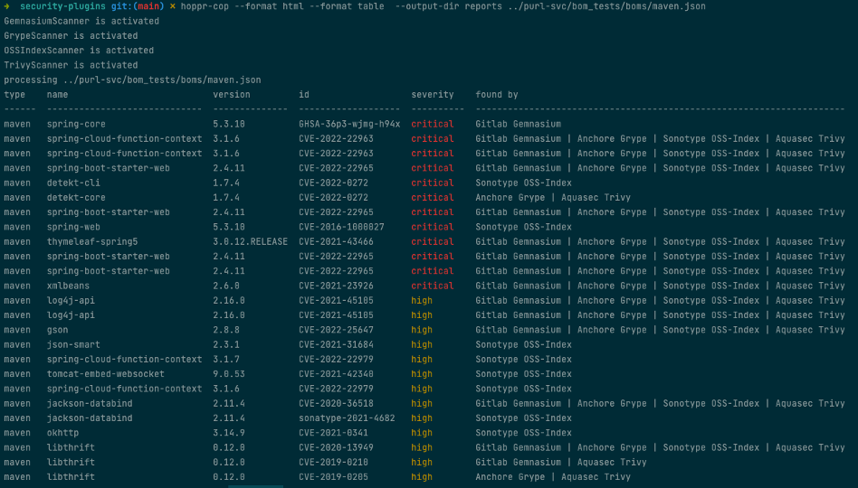

# Hoppr-Cop
### For Policing Your SBOM Vulnerabilities

Hoppr Cop is a cli and python library that generates high quality vulnerability information from a [cyclone-dx](https://cyclonedx.org/)
Software Bill of Materials (SBOM) by aggregating data from multiple vulnerability databases.
This project is offered as part of the [hoppr](https://hoppr.dev/) ecosystem, however it is fully functional as a standalone cli or python library. 

For more information please see the [project documentation](https://hoppr.gitlab.io/hoppr-cop/)

## Project Status

Alpha 

## Features

* Integrates data from four leading opensource vulnerability databases 
  * [gemnasium community](https://advisories.gitlab.com)
  * [grype](https://github.com/anchore/grype)
  * [trivy](https://aquasecurity.github.io/trivy/v0.31.2/)
  * [oss-index](https://ossindex.sonatype.org/)
* Combines information from these sources in a way that reduces duplicates and ensures complete information for each vulnerability. 
* Generates reports in multiple formats
  * [cyclone-dx vex](https://cyclonedx.org/capabilities/vex/) either embedded in the existing bom or as a standalone file.  
  * [html](https://hoppr.gitlab.io/hoppr-cop/example-reports/npm-vulnerabilities.html) - detailed vulnerability information that can be viewed in disconnected networks. 
  * Gitlab Dependency Scanning - Which enables  [Vulnerability Reports](https://docs.gitlab.com/ee/user/application_security/vulnerability_report/),
  [Dependency List](https://docs.gitlab.com/ee/user/application_security/dependency_list/), and [Security Dashboard](https://docs.gitlab.com/ee/user/application_security/security_dashboard/)
  
## Why 

SBOMs provide an ideal way to inventory all the dependencies in a project. A project's vulnerabilities should be monitored on a regular basis. 
`hoppr-cop` provides an easy mechanism to keep your vulnerability information up to date without regenerating an SBOM. 
The vex and html reports provide an ideal way to communicate vulnerability status to users, even in disconnected networks.  

### Why Use Multiple Scanners

- Provides broad coverage of the upstream vulnerability data sources.  You can see the full details of the data-sources [here](docs/data-sources.md). Gitlab and Sonotype provide their own vulnerability reporting that you won't get elsewhere. 
- Provides much better coverage of a variety of package manager types.  Each bom scanner has package managers that it excels at scanning, and some that it does a poor job of.  Additionally, each product supports a different set of package ecosystems.
- Seeing that multiple datasources agree on a finding, improves confidence that the finding is not a false positive. 
- Combining information from multiple sources leads to more complete and accurate information for each vulnerability identified, leading to quicker resolutions. 

## Demo

## Documentation
For more information please see the [project documentation](https://hoppr.gitlab.io/hoppr-cop/)
